- [7. Electric Breakdown Phenomena](#7-electric-breakdown-phenomena)
  - [1. Purpose](#1-purpose)
  - [2. Principles](#2-principles)
    - [2.1 Electric Breakdown of Gas](#21-electric-breakdown-of-gas)
    - [2.2 Standard Sphere Gaps](#22-standard-sphere-gaps)
    - [2.3 Needle-Plane Electrode](#23-needle-plane-electrode)
    - [2.4 Composite Insulation System and Its Interface](#24-composite-insulation-system-and-its-interface)
    - [2.5 Partial Discharges (Corona Discharges)](#25-partial-discharges-corona-discharges)
    - [2.6 Types of Partial Discharges](#26-types-of-partial-discharges)
    - [2.7 Problems of Composite Insulation System](#27-problems-of-composite-insulation-system)
    - [2.8 Equivalent Circuit for Composite Systems](#28-equivalent-circuit-for-composite-systems)
    - [2.9 Quantities Describing Partial Discharges](#29-quantities-describing-partial-discharges)
    - [2.10 $V-t$ Characteristics](#210-v-t-characteristics)
  - [3.Experimental Topics and Methods](#3experimental-topics-and-methods)
    - [3.1 Calibration of Transformer](#31-calibration-of-transformer)
    - [3.2 Discharge Phenomena of Standard Sphere Gaps](#32-discharge-phenomena-of-standard-sphere-gaps)
    - [3.3 Discharge Phenomena of a Needle-Plane Electrode in Air](#33-discharge-phenomena-of-a-needle-plane-electrode-in-air)
      - [3.3.1 Measurement of Discharge Voltages for Alternating Voltage](#331-measurement-of-discharge-voltages-for-alternating-voltage)
      - [3.3.2 Measurement of Discharge Voltages for Direct Voltage](#332-measurement-of-discharge-voltages-for-direct-voltage)
    - [3.4 Measurement of Surface Discharge Voltage](#34-measurement-of-surface-discharge-voltage)
    - [3.5 Measurement of Void Discharge Voltage](#35-measurement-of-void-discharge-voltage)
    - [3.6 Measurement of $V - t$ Characteristics](#36-measurement-of-v---t-characteristics)
  - [4.Experimental results and discussions](#4experimental-results-and-discussions)
    - [4.1 Calibration of Transformer](#41-calibration-of-transformer)
    - [4.2 Discharge Phenomena of Standard Sphere Gaps](#42-discharge-phenomena-of-standard-sphere-gaps)
    - [4.3 Discharge Phenomena of a Needle-Plane Electrode](#43-discharge-phenomena-of-a-needle-plane-electrode)
    - [4.4 Measurement of Surface Discharge Voltage](#44-measurement-of-surface-discharge-voltage)
    - [4.5 Measurement of Void Discharge Voltage](#45-measurement-of-void-discharge-voltage)
    - [4.6 Measurement of $V - t$ Characteristics](#46-measurement-of-v---t-characteristics)
  - [5. Report Contents](#5-report-contents)
  - [6. Process of this experiment](#6-process-of-this-experiment)
    - [Time sequence (Before and After the experiment)](#time-sequence-before-and-after-the-experiment)
  - [Experimental Instruments](#experimental-instruments)
  - [Reference](#reference)

# 7. Electric Breakdown Phenomena

## 1. Purpose

1. Learn how to operate a high-voltage transformer.
2. Learn the method of measuring high voltage with standard sphere gaps.
3. Understand and observe electric breakdown phenomena in uniform and non-uniform fields.
4. Understand electric breakdown phenomena at material interfaces.
5. Understand the partial discharge degradation phenomena of solid insulating materials and learn how to measure partial discharge.

Keywords : electric breakdown, discharge of gas, interfacial phenomena, partial discharge, $V - t$ characteristics

## 2. Principles

### 2.1 Electric Breakdown of Gas

By gradually increasing the applied voltage to electrodes placed in a gas (e.g. atmospheric air), the insulation between the electrodes is broken down by spark discharge. The performance of the electric breakdown depends upon the uniformity of the electric field between the electrodes. In the case of a uniform field, using an infinite plane-plane electrode or Rogowski electrode, spark discharge occurs when the applied voltage exceeds a critical voltage. This phenomenon is expected for a uniform field.

In the case of a non-uniform field, using a needle-plane electrode, light of weak intensity is emitted at the tip of the needle electrode and a small electric current flows in the gap when the applied voltage is increased. The phenomenon of partially ionized plasma may be observed only at the tip of the needle electrode and is not observed at any other region of the electrode system. This localized discharge is called "partial discharge" or "corona discharge". As the applied voltage is increased, partial discharge grows up. Finally, when the applied voltage reaches a critical value, spark discharge occurs between the electrodes.

### 2.2 Standard Sphere Gaps

Because the manufacture of Rogowski electrodes, which generate a uniform field, and setting the gap spacing in a Rogowski electrode require high technical skill, the sphere-sphere electrode configuration is often used instead of a Rogowski electrode. Spark discharge occurs directly without corona discharge if the gap spacing is small enough compared with the radius of the sphere electrode. Therefore, the field generated in the gap can be regarded as being uniform. The standard sphere gap consists
of two sphere electrodes with the same diameter, fixed at the desired spacing. As shown in Table 1, the discharge voltage of a standard sphere gap is uniquely determined by the gap spacing and the diameter of the sphere electrode. Standard sphere gaps are used to measure high alternating, direct and impulse voltages.

Table 1 shows the discharge voltages for standard conditions (1013 hPa,20${}^\circ$C). 
The corrected discharge voltage for other conditions can be calculated by the following equation:

$$V = kV_n $$

$V$: discharge voltage for atmospheric pressure $b$ \[hPa\] and atmospheric temperature $t$ \[${}^\circ$C\]

$V_n$: discharge voltage for standard conditions

$k$: correction factor for relatice air density $\delta$ 

$\delta$: relatice air density

$$\delta = (\frac{b}{1013}) (\frac{273+20}{273+t}) $$

Table 1. Discharge voltage of standard sphere gaps at standard conditions[kV] ( diameters of spjere electrode is 20mm )

|    gaps   $[$mm$]$   | Discharge voltage[kV] |
|:------------:|------------------------------------:|
|     0.5      |                                 2.8 |
|     1.0      |                                 4.7 |
|     1.5      |                                 6.4 |
|     2.0      |                                 8.0 |
|     2.5      |                                 9.6 |
|     3.0      |                                11.2 |
|     4.0      |                                14.4 |
|     4.5      |                                15.9 |
|     5.0      |                                17.4 |

Table 2. Correction factor $k$ of discharge voltage of standard sphere gap as a
function of relative air density $\delta$

| $\delta$ | 0.72 | 0.77 | 0.82 | 0.86 | 0.91 | 0.95 | 1.00 | 1.05 | 1.09 | 1.13 |
|:--------:|-----:|-----:|-----:|-----:|-----:|-----:|-----:|-----:|-----:|-----:|
|   $k$    | 0.70 | 0.75 | 0.80 | 0.85 | 0.90 | 0.95 | 1.00 | 1.05 | 1.10 | 1.15 |

### 2.3 Needle-Plane Electrode

A needle-plane electrode generates a non-uniform field, with the field at the tip of the needle strongly enhanced. In the non-uniform field, stable corona discharges can be observed.
Spark discharge occurs when the applied voltage is increased sufficiently, with the discharge taking various corona discharge morphologies. The morphology of the corona discharge depends on the field distribution of the space charge in the gap, the waveform, the polarity, and the magnitude of the applied voltage.
The polarity effect can be observed in that the spark discharge voltage is different for positive and negative needle electrodes. 

Fig.1 shows typical corona discharge current waveforms. Corona discharges occur if the following
conditions are simultaneously satisfied:

1. Strong field enhancement occurs in a non-uniform field.

2. The corona discharge reduces the maximum field.

Condition 2. is the necessary condition for the existence of stable corona discharge. If condition 2. is not satisfied, spark discharge occurs due to the growth of the local ionization.

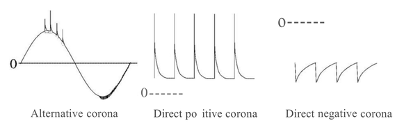

Fig.1 Examples of corona discharge current waveforms for a needle-phane electrode

### 2.4 Composite Insulation System and Its Interface

In electrical insulation for electric power apparatuses, the use of only gas or liquid, or solid alone as an insulation material is extremely rare.
Gas and solid or liquid and solid as a composite insulation system are generally used. A composite insulation system consists of two or more different insulation materials. An interface exists at the boundary of the different materials in the composite insulation system. The interface is a weak point of the insulation. Therefore, the electrical performance of the system depends on the state of the interface. For instance, in a composite insulation system of gas and solid, surface discharge occurs at the interface.

The external interface between gas and solid and the internal interface between solid and solid are well-known practical significant interfaces. 
A polymer insulator with an interface between air and synthetic rubber is a typical example of an external interface. A CV cable with an interface between synthetic rubber and cross-linked polyethylene is a typical example of an internal interface.

### 2.5 Partial Discharges (Corona Discharges)

Partial discharge is a localized discharge that occurs in the region of a strongly enhanced field. This discharge had been considered a corona discharge. However, as the discharge pattern does not always express a corona, that is, a small ring that has been used for decoration on the roof of a church, the generic name of this localized discharge has become partial discharge. As mentioned above, by applying a voltage to an electrode system generating a non-uniform field (e.g. a needle-plane electrode), partial discharge can be easily observed.

Electric power apparatuses with composite insulation are designed so that partial discharges do not occur in service conditions. However, when an overvoltage is applied or when long-term deterioration in the insulation materials has occurred, partial discharge can occur in the region of strongly enhanced fields in composite insulation systems.
Research has been carried out on electrical insulation diagnosis based on pattern recognit ion of partial discharges.

### 2.6 Types of Partial Discharges

Partial discharges in composite insulation systems can be classified into three types, as shown in Fig.2. We note however
that partial discharges in actual electrical apparatus are more complicated.

1. Surface discharges
    Discharges along an interface in a composite insulation system. This type of discharge can be observed along the solid dielectric surface in a gas, along the solid dielectric surface in a liquid, and the interface between a gas and a liquid.

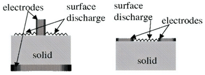
Fig.2(a) Surface discharges

2. Gap discharge
    Discharge in the gap between an electrode and a solid. The discharge grows perpendicular to a solid dielectric.

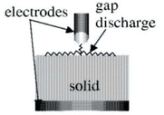
Fig.2(b) gap discharge

3. Void discharge
    Discharge in a gaseous cavity within a solid dielectric. The use of a metal electrode does not affect this type of discharge.

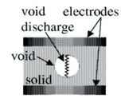
Fig.2(c) gap discharge
Fig.2 Types of partial discharges in composite insulation systems

### 2.7 Problems of Composite Insulation System

Fig.3 shows a composite insulation system with a gas dielectric (thickness $d_1$ , specific permittivity c1 ) and a solid dielectric (thickness $d_2$ , specific permittivity $\epsilon_2$ ) in a uniform field. When a voltage $V$ is applied to the electrode arrangement, the field strength $E_1$ in the gas dielectric and the field strength $E_2$ in the solid dielectric are given as follows:

$$E_1 = \frac{\epsilon_2V}{\epsilon_1d_2+\epsilon_2d_1} ,  E_2 = \frac{\epsilon_1V}{\epsilon_1d_2+\epsilon_2d_1}$$

where these equations are derived by considering only the capacitance of each dielectric.

As the specific permittivity is unity for air, the field strength in the gas dielectric is increased by a factor of $\epsilon_2$ over that in the solid dielectric. The breakdown strength of air (i.e. the field strength at which electric breakdown occurs) is smaller than that of the solid. 
When an overvoltage is applied to the composite insulation system, partial discharge occurs in the air. As the system does not suffer electrical breakdown (there is no bridging between electrodes) unless breakdown occurs in the solid dielectric, only partial discharge may occur in the air. However, the solid dielectric in the system may deteriorate gradually due to the partial discharge in the air until finally, the insulation system breaks down. Therefore, the insulation of the electric power apparatus is designed so that partial discharge does not occur.

In the case of a void surrounded by the solid dielectric, as shown in Fig.2(c), the field strength in the void is given as follows:

$$\begin{aligned}
  E_v &=& \epsilon_s E (the case of a thin void) \\
  E_v &=& \frac{3E}{2+\frac{1}{\epsilon_s}} (the case of a spherical void)
\end{aligned}$$

where E and cs denote the external electric field and the specific permittivity of the solid, respectively.

As the field strength in the void is larger than that in the surrounding medium and the electric breakdown strength of air is much smaller than that of the solid, partial discharge (void discharge) may occur in the void. As mentioned above, the surrounding dielectric may deteriorate due to the partial discharge. Therefore, in the design of insulation for electric power apparatus, attention must be paid to removing voids as much as possible or to reducing the volume of cavities to reduce the probability of void discharge occurring.

### 2.8 Equivalent Circuit for Composite Systems

To understand partial discharge phenomena, a simplified equivalent circuit is often used.
Fig.3 shows a typical example of an electrode arrangement of a composite insulation system with a gas dielectric and a solid dielectric. Assuming that a dielectric can be represented by a capacitance only, the composite insulation system shown in
Fig.3 can be expressed by the equivalent circuit shown in Fig.4. 
Here $C_a$ represents the capacitance of the gas, $C_s$ represents the capacitance of the solid, and $G$ represents the gap.

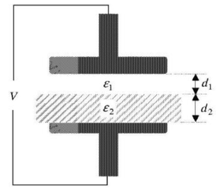
Fig.3 Construction of composite (double layer) insulation
system

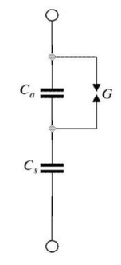
Fig.4 Equivalent circuit

For a sinusoidal applied voltage $V$ , the voltage across $C_a$ is denoted by $V_a$ and the partial discharge inception voltage of air is denoted by $V_g$. When no partial discharges occur in the gap $G$, the voltage across $C_a$ is denoted by $V_a^{\prime}$ in Fig.4, with the applied voltage divided between $C_a$ and $C_s$. However, as partial discharge occurs in the gap when $V_a$ reaches $V_g$, the voltage across $C_a$ varies as $V_a$. At point 1 in Fig.4, discharge begins in the gap $G$. At point 2, the charge stored by $C_a$ is discharged through $G$, and $C_s$ is recharged from the power supply. 
At this time, the discharge stops. However, as the applied voltage from the power supply continuously increases, $V_a$ across $C_a$ also increases. At point 3, discharge starts in the gap $G$ again when $V_a$ reaches $V_g$.
As the process of charging and discharging repeats, partial discharge pulses are observed predominantly in the region of the voltage crossover.

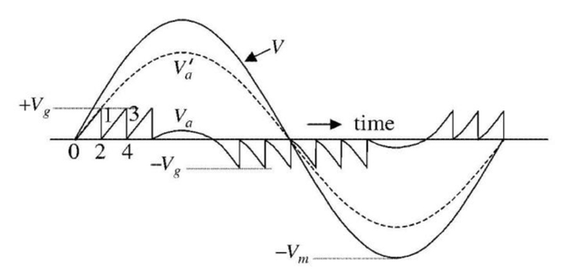
Fig.5 Voltage waveforms across air gap

### 2.9 Quantities Describing Partial Discharges

To evaluate partial discharges quantitatively, the following quantities are generally used.

1.  Discharge inception voltage ($V_i$), discharge extinction voltage ($V_e$) : $V_i$ is the voltage at which partial discharge is first observed as the applied voltage is increased. $V_e$ is the voltage at which partial discharge stops being observed as the voltage is decreased after observing the partial discharge inception voltage. The values of these voltages include a scattering statistical factor. They also vary dependent on the voltage history.

2.  Charge ($q$): $q$ is the charge of a part ial discharge. It is impossible to find the true value of $q$, though a reasonable
    approximation can be made.

3.  Maximum charge ($q_{max}$): $q_{max}$ is the maximum charge of any partial discharges occurring over a given period.

4.  Number of partial discharge pulses ($N$): $N$ is the number of partial discharge pulses that occur in unit time. $N$ is usually estimated by the pulse count per second.

5.  Discharge energy: This is the energy of a partial discharge.

We must pay attention to the relations between the quantities above and the phase($\phi$) of the applied voltage. Applying the partial discharge quantities to insulation diagnosis has been considered because the values change over time due to the degradation of the insulation performance.

As discussed in Section 2.8, a pulse-shaped current flows through the system when partial discharge occurs in the material under test. In general, this current can be measured as a pulse-shaped voltage across an appropriate impedance connected to the measuring circuit. Typical test circuits for measuring partial discharges are shown in Fig.5.
Fig.6(a) shows a test circuit in which the material under test is grounded

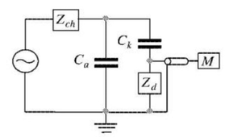
Fig.6(a) surface discharges

Fig.6(b) shows a test circuit in which the material under test is isolated

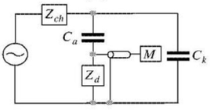
Fig.6(b) gap discharge

Fig.6(c) shows a test circuit in which noise reduction can be performed by using two materials under test. 

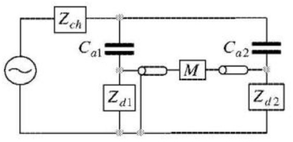
Fig.6(c) void discharge
Fig.6 Test circuits for measuring partial discharges

 $C_a$,$C_{a1}$,$C_{a2}$ : capacitances of material under test

 $C_k$ : coupling capacitance 

 $Z_d$ : detection impedance 
 
 $Z_{ch}$ : choke impedance
 
 $M $ : measuring circuit 

As shown in Fig.6, the detection impedances can be constructed from resistances, capacitances, inductances and combinations of these.

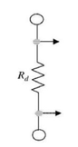
Fig.7(a) R type

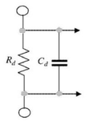
Fig.7(b) CR type

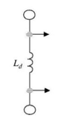
Fig.7(c) L type

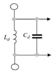
Fig.7(d) LC type

Fig.7. Detection impedances

### 2.10 $V-t$ Characteristics

When a voltage (a high voltage that is used in accelerated testing methods) is applied to a composite insulation system, the relation between the applied voltage $V$ and the time to breakdown (lifetime) $t$ can be expressed by a well-known empirical law:

$$V^n t = const. $$

This is called the inverse power law and is applied to insulation diagnosis. The $V - t$ characteristics of an insulation system can be obtained by measuring the lifetime at various applied voltages. $n$ is calculated from two measuring points 
$P_1=(t_1,V_1),P_2=(t_2,V_2) (t_1>t_2,V_1<V_2)$ with the following equation.

$$n = \frac{\log{t_1}-\log{t_2}}{\log{V_2}-\log{V_1}}  $$

## 3.Experimental Topics and Methods

Before all else, all experiments must observe the following safety guidelines:

- Pay special care to avoid getting an electric shock during experiments. Also, keep other people away from your experiment site.
- Confirm that the output voltage of the slidac is zero before turning on the switch.
- Rapidly decrease the applied voltage to zero using the slidac when spark discharge occurs.
- Check the following items before changing the connection of the test circuit:

1.  Turn off the switch of the power supply.
2.  Lightly touch the high voltage terminal using the earthed stick.
3.  Confirm that the output voltage of the slidac is zero.

<u>In a test circuit containing a capacitance, change the connection of the circuit only after discharging by using the earthed stick.</u>

- Keep away from areas in which high voltages are generated.
- Shut off the circuit immediately when anything abnormal is observed.
- The experimental circuit must be checked by the supervisor before each experiment is started.

### 3.1 Calibration of Transformer

In the test circuit shown in Fig.8, find the relation between the input and output voltages by the following procedure.

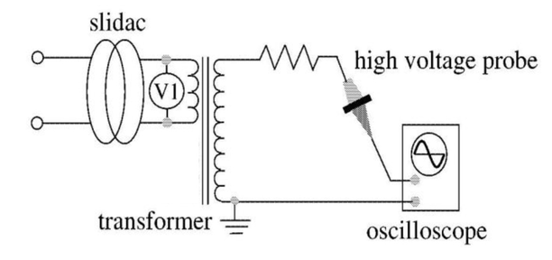
Fig.8 Calibration circuit of transformer

1.  Apply an appropriate voltage by adjusting the output voltage of the slidac.
2.  Measure the output voltage of the transformer by using a high-voltage probe and an oscilloscope.
3.  Measure the output voltage for a few levels of input voltages.
4.  Make a graph showing the relation between the input and output voltages.

### 3.2 Discharge Phenomena of Standard Sphere Gaps

In the test circuit shown in Fig.9, observe the discharge phenomena of gas in the uniform field by the following procedure.

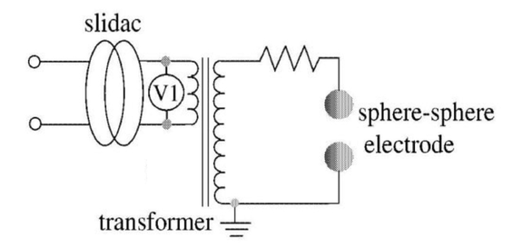
Fig.9 Experimental circuit for measuring discharge voltages of standard sphere gaps

1.  Set the gap length to 1.5 mm. Increase the applied voltage gradually by adjusting the slidac. Record the voltmeter reading when spark discharge occurs. Repeat the measurement three times and calculate the average spark discharge voltage.

2.  Perform the same measurement for gap lengths of 3 mm and 4.5 mm.

### 3.3 Discharge Phenomena of a Needle-Plane Electrode in Air

observe the discharge phenomena of the gas in a non-uniform field for alternating
and direct voltages.

#### 3.3.1 Measurement of Discharge Voltages for Alternating Voltage

.png)
Fig.10 Experimental circuit for measuring discharge voltages of needle-plane electrode (alternating voltage)

1.  Set the gap length to 1.5 mm, 3 mm, and 4.5 mm and perform the
    experiment described in Section 3.2.

2.  Apply an appropriate voltage to the needle voltage and confirm that the partial discharge occurs. Record the waveform of the partial discharge current that flows through the circuit.

#### 3.3.2 Measurement of Discharge Voltages for Direct Voltage

For positive and negative needle electrodes, perform the experiment as in Section 3.3.1.

.png)
Fig.11 Experimental circuit for measuring discharge voltages of needle-plane electrode (direct voltage)

### 3.4 Measurement of Surface Discharge Voltage

In this experiment, a cylindrical solid insulating rod (acrylic resin or glass-fiber reinforced plastic (GFRP)) is placed between two plane electrodes in the air. Surface discharge of the solid-gas composite insulation system is observed for an AC voltage.

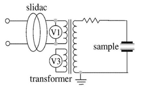
Fig.12 Experimental circuit for surface discharge voltage measurement

1.  Fix the 5-mm-thick cylindrical solid between the two plane electrodes.
2.  Increase the applied voltage gradually by adjusting the slidac.
    Record the voltmeter reading when surface discharge occurs and observe the position where the discharges occur.
3.  Repeat the measurement three times and calculate the average surface discharge voltage.
4.  Using cylindrical solids with thicknesses of 10 mm and 20 mm, repeat the experiment.
5.  Repeat the procedure for cylindrical GFRP.

### 3.5 Measurement of Void Discharge Voltage

Measure the fundamental characteristics of partial discharge in a void formed in a solid dielectric. The samples are made of two or three acrylic plates. The test circuit is shown in Fig.13. 
Measure the dimensions of the void beforehand. Place the acrylic plates between two plane electrodes, and make measurements as described below.

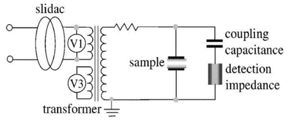
Fig.13 Experimental circuit for void discharge and $V-t$ characteristics

1.  Increase the applied voltage slowly by adjusting the slidac and measure the partial discharge inception voltage $V_i$.
2.  Applying a voltage of approximately 120% of V; and confirm the occurrence of steady discharges. Record the amplitude of the discharge pulse-shaped current, the pulse occurrence rate of the discharge, and the pulse occurrence phase of the discharge.
3.  Decrease the applied voltage slowly by adjusting the slidac and measure the partial discharge extinction voltage $V_e$.
4.  Repeat the measurement three times and calculate the average $V_i$ and $V_e$.

### 3.6 Measurement of $V - t$ Characteristics

By using a rod-plane electrode, check the degradation of insulation performance in a composite insulation system. Place a polyethylene film of 100$\mu$m thickness between two electrodes, and make measurements as described below. Note that the tip of the rod electrode will lightly touch the surface of the polyethylene film.

1.  Following the same procedure as in Section 3.5, measure the partial discharge inception and extinction voltages, repeating the measurement three times. After finishing the measurements, remove the detection impedance and coupling capacitance from the experimental circuit.
2.  Apply a constant high voltage to the rod electrode and measure the time to breakdown (lifetime) of the polyethylene film.
3.  Renew the film.
4.  Set a different applied voltage and repeat the experiment until
    obtaining an apropiate constant n of the inverse power law.

## 4.Experimental results and discussions

Matters common for all experiments are the following:

1.  Present all experimental results. All table and figure must be written in English. Note that the simplest and most effective description method is preferred.
2.  Denote your findings with respect to all tables and figures from above 1...
3.  Describe the reasons for errors in measured values on multiple measurements.

### 4.1 Calibration of Transformer

1.  Find the ratio of the transformer.
2.  Discribe the reason why cause differece between transformation ratio of voltage and winding ratio of primary and secondary.

### 4.2 Discharge Phenomena of Standard Sphere Gaps

1.  Compare the Experimental and theoricaldischarge voltages.
2.  Explain why the sphere-sphere gap is used for the measurement of high voltages.

### 4.3 Discharge Phenomena of a Needle-Plane Electrode

1.  Based on the experimental results (Standard Sphere Gaps and Needle-Plane Electrode), explain the differences in the discharge of gas in uniform and non-uniform fields.
2.  Survey polarity effect of corona behavior (difference between positive and negative corona discharges).

### 4.4 Measurement of Surface Discharge Voltage

1.  Report the position where the discharges occur.
2.  Discuss the relationship between discharge voltage and relative permittivity of samples.

### 4.5 Measurement of Void Discharge Voltage

1.  Show graphically relationships between average $V_i$ and $V_e$.
2.  Show measured voltage discharge waveforms and report the amplitude of the discharge pulse-shaped current, the pulse occurrence rate of the discharge, and the pulse occurrence phase of the discharge. The reference for counting the number of pulses occurrence must be clearly indicated.

3.  The equivalent circuit of an insulation system with a void described in Section 3.5 is shown in Fig.13. Illustrate the theoretical voltage waveforms for the void. The parameters for the equivalent circuit required for the computation will be given at the time of the experiment.
4.  Compare measured and theoretical voltage waveforms and discuss differences between them.

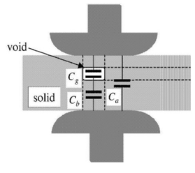 

Fig.14 Insulation system with a void and the equivalent
circuit

### 4.6 Measurement of $V - t$ Characteristics

1.  Show the derivation process of equation
$$n = \frac{\log{t_1}-\log{t_2}}{\log{V_2}-\log{V_1}}  $$
from 
$$V^n t = const. $$
2.  Find the constant $n$ of the inverse power law.
3.  Discuss the usefulness of the inverse power law about insulation materials.

## 5. Report Contents

The report must be included as following contents:

1.  Specified cover (First page)

2.  Summary of this report and purpose in this experiment (Second page). Summary consists of purpose in this experiment, method, results and discussions in each experiment and reveals achievement to purpose in this experiment as conclusion. Summary in this report and purpose in this experiment must be written in second page by only text and not need to use by figure or table.
3.  Experimental methods ( Each experimental circuit must be included. Experimental procedures not need to be required )
4.  Experimental results and discussions (complete all items in section 4)
5.  Impressions on the implementation of this experiment

The references in the report must be specified in the following format:

~~~
\[Ref.No\] authors, title, publisher (site:URL), ..., 
~~~

The references must be written in English or Japanese. See "References" in this paper as an example and learn about "Writing Support" in English site or in Japanese site .

## 6. Process of this experiment

This theme divides the group into first half group and second half group by students list order, which each half group are 5-7 students. You should know your group and the members before the experiment and prepare each experiment based on following task and each group process shown in Table 3.

Table 3. Each group process

|    Group  | Members | Experiment section number at First week | Second week | Third week(presentation) |
|:------------:|------------------------------------:|------------------------------------:|------------------------------------:|------------------------------------:|
|     First half group     |       Half of the list                         |  3.1 - 3.3 | 3.4 - 3.6  | 3.1 - 3.3 |
|     Second half group      |          Other than the first half group      | 3.4 - 3.6 |  3.1 - 3.3 |  3.4 - 3.6| 

The number of First half group member is rounded up to the nearest whole number.

### Time sequence (Before and After the experiment)

1.  Before the experiment (First week): Learn video and **answer simple questions** about this experiment. The video and the answer form can be found in the moodle course.

2.  Until before day in presentation (Third week): Submit **Presentation file (.pptx)** to designated moodle course.

3.  Before presentation (Third week):Submit **small report printed paper**, which is not online data. Small report must be included
    **all experimental results and its sufficient explanation**, but the discussions are not required. Small report is necessary not only to show simple figures and tables, but also to obey the manner about the experimental report.

4.  After presentation: Submit **report in Chapter 5 by online via moodle course until specified deadline. The report must be revised according to comments from the instructor in small report to be accepted.

5.  After submission: If the report was accepted, make use of report's feedback from the instructor in the future. If the report was not
 accepted, **resubmit the reports** revised according to comments from the instructor **within 2 weeks** later from received comments.

The number of late submission in whole experiment are add the number of late submission in any process, which is counted per each process.

## Experimental Instruments

1.  Sphere-sphere electrode, needle-plane electrode, plane-plane
    electrode, rod-plane electrode
2.  Transformer
3.  Slidac
4.  High voltage probe
5.  High Voltage capacitor, high voltage resistor
6.  Oscilloscope

## Reference

[1]The Institute of Electrical Engineers of Japan: "Discharge Handbook",(1974) (in Japanese)

[2]T.Ooshige and M.Hara: "High Voltage Phenomena",Morikita Publishing (1984) (in Japanese)

[3]M.leda: "Modern High Voltage Engineering", Ohmsha Publishing (1981) (in Japanese)

[4]M.Kosaki:"High Voltage Engineering and Electrical Insulation", Ohmsha Publishing (2000)

[5]University of Tokyo Library System, "Writing Support",
https://www.lib.u-tokyo.ac.jp/en/library/literacy/user-guide/campus/report

[6]東京大学付属図書館，「レポート・論文作成支援」(in Japanese of Ref.[5])
https://www.lib.u-tokyo.ac.jp/ja/library/literacy/user-guide/campus/report
